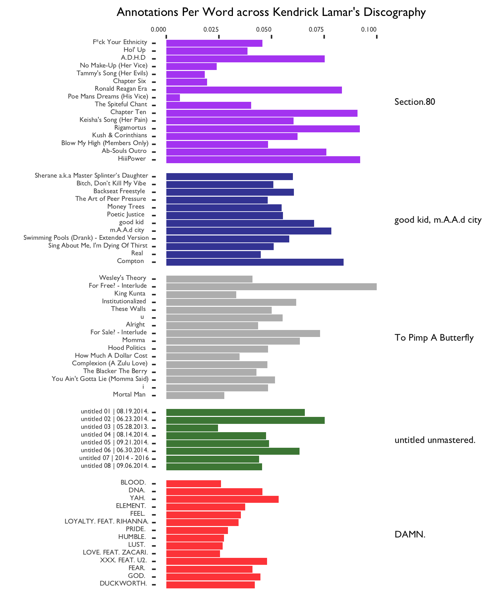
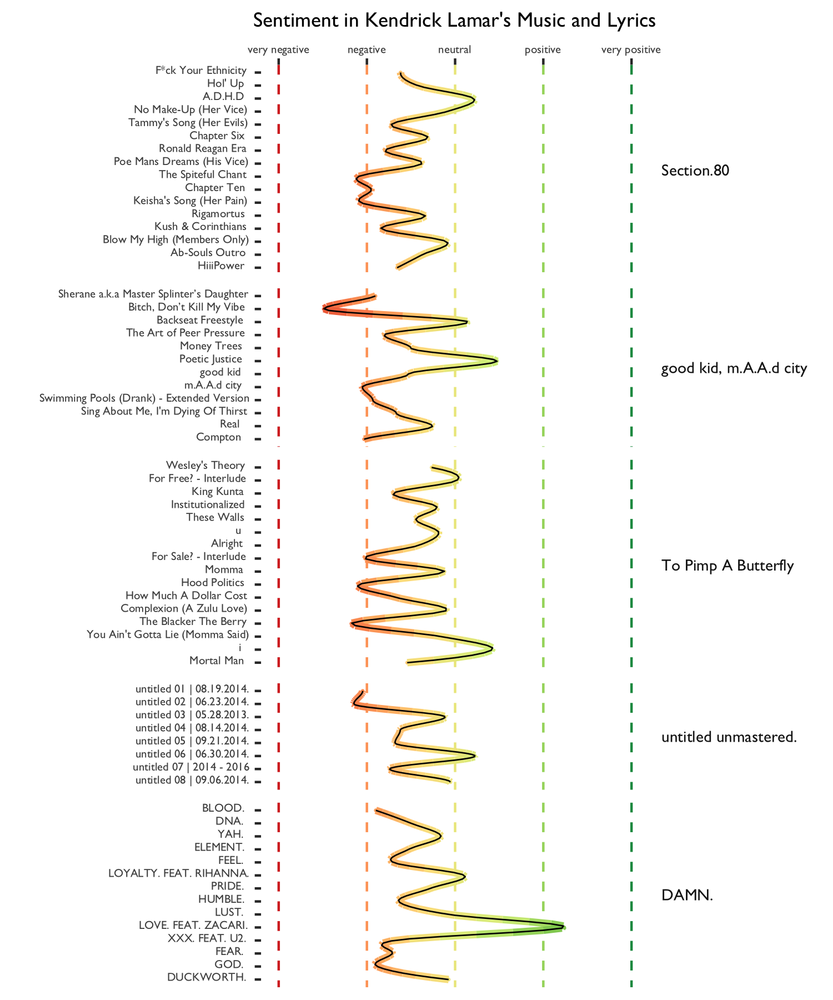
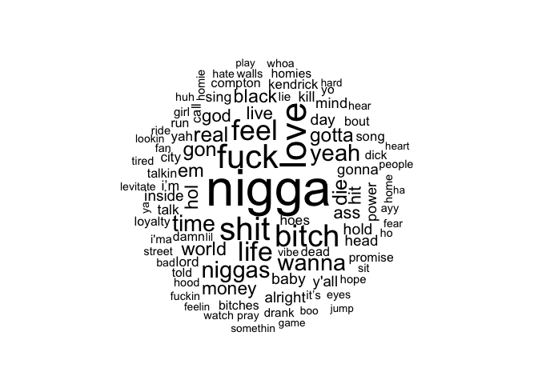
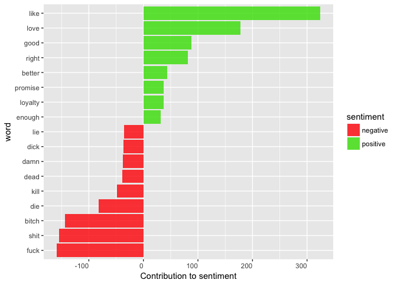
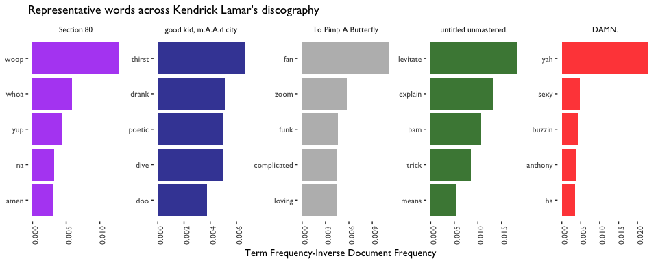
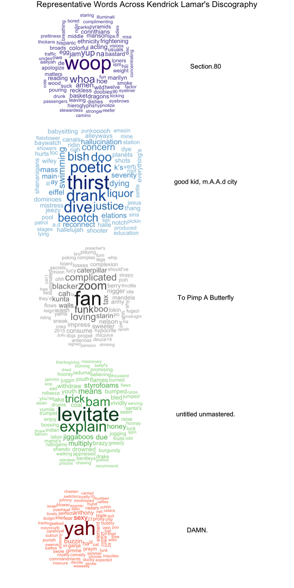
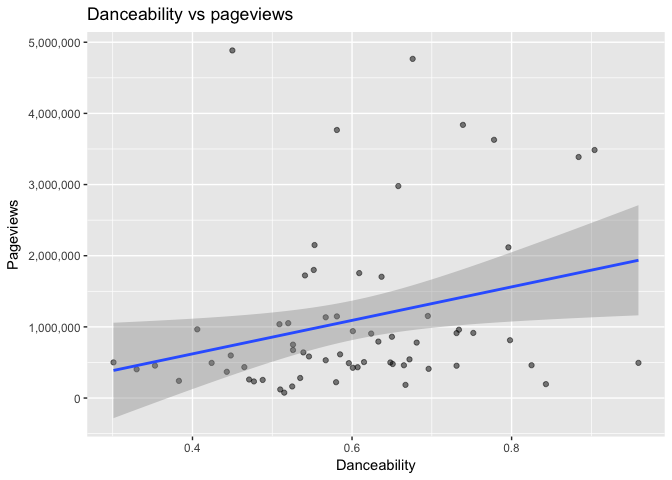
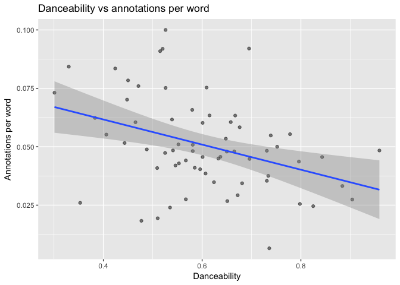

Kendrick LamaR
================

Below is some analysis and visualization of Kendrick Lamar's music, using data from Spotify's and Genius's APIs. The script I used to query the data, which is adapted from RCharlie's post [fitteR happieR](http://rcharlie.com/2017-02-16-fitteR-happieR/), can be found [here](https://github.com/laingdk/kendrick/blob/master/src/scrape_kendrick.R). If you'd like to download the data yourself, you can find it [here](https://github.com/laingdk/kendrick/blob/master/data/scraped_kendrick_data.csv).

Let's get started!

``` r
# Load it up.
kendrick <- read.csv("../data/kendrick_data.csv")

# Fix the factor levels for the albums.
kendrick$album_name <- factor(kendrick$album_name, levels = c("Overly Dedicated", "Section.80", "good kid, m.A.A.d city", "To Pimp A Butterfly", "untitled unmastered.", "DAMN."))

# Remove Overly Dedicated (because it's technically a mixtape, not a studio album).
kendrick <- kendrick %>% filter(album_name != "Overly Dedicated")

# Get word counts for each album. This might be useful later.
album_word_counts <- kendrick %>% group_by(album_name) %>% summarise(word_count = sum(song_word_count))

# Fix the factor levels for the tracks.
kendrick$track_name <- factor(kendrick$track_name, levels = as.character(kendrick$track_name))
```

Let's see which of Kendrick's songs are the most analysed on Genius. One measure of this is the number of annotations for a given song. The only problem is that some songs have fewer lyrics than others, and no lyric can have more than one annotation. So let's use the number of annotations per lyric.

``` r
# Plot the annotations per word.
annotation_plot <- ggplot(kendrick) +
        geom_col(aes(x = track_name,
                     y = annotations/song_word_count,
                     fill = album_name), 
                 alpha = 0.8,
                 show.legend = FALSE) +
        facet_grid(~album_name, scales = "free", space = "free") +
        theme_tufte(base_family = 'GillSans') +
        theme(axis.text.x=element_text(size=5, angle=90,hjust=0.95,vjust=0.2),
              axis.text.y=element_text(size = 5, angle=90),
              axis.title.x=element_text(size = 9, angle=180),
              axis.title.y=element_text(size = 9, angle = 90),
              strip.text = element_text(size = 7, angle = 90, vjust=0)) +
        scale_fill_manual(values = c("purple", "darkblue", "darkgrey", "darkgreen", "red")) +
        ylab("Annotations Per Word across Kendrick Lamar's Discography") +
        xlab("")

# Save the plot.
ggsave("../results/annotation_plot.png", width = 6, height = 5)

# Read it back in.
annotation_plot <- image_read('../results/annotation_plot.png')

# Rotate it.
annotation_plot <- image_rotate(annotation_plot, 90)

# Save it again.
image_write(annotation_plot, path = "../results/annotation_plot.png", format = "png")
```



Sentiment Analysis
------------------

Spotify's API provides a column called "valence", which is defined as follows:

> A measure from 0.0 to 1.0 describing the musical positiveness conveyed by a track. Tracks with high valence sound more positive (e.g. happy, cheerful, euphoric), while tracks with low valence sound more negative (e.g. sad, depressed, angry).

I'm also interested in the sentiment in the lyrics alone, and I think we can find a better description of the valence of the song by combining the lyric sentiment with Spotify's valence measure. Below I compute the sentiment of each song, by joining the lyrics with the Bing lexicon — a list of words which are labelled (by humans) as positive or negative.

``` r
# Change the text from factor to character.
kendrick$lyrics <- as.character(kendrick$lyrics)

# Get one word per row.
tidy_kendrick <- kendrick %>% unnest_tokens(word, lyrics)

# Remove the stop words.
cleaned_kendrick <- tidy_kendrick %>%
        anti_join(stop_words)

# Get the sentiment of words in the Bing lexicon.
bing <- get_sentiments("bing")

# Get the sentiment across the tracks.
kendrick_sentiment <- cleaned_kendrick %>%
        inner_join(bing) %>%
        count(track_name, sentiment) %>%
        spread(sentiment, n, fill = 0) %>%
        mutate(sentiment = (positive - negative)/(positive + negative))

# Join.
kendrick <- inner_join(kendrick, kendrick_sentiment)

# Get a smarter measure of sentiment.
kendrick <- kendrick %>% mutate(smart_sentiment = (sentiment + (valence*2)-1)/2)
```

We have the sentiment for each song, so let's plot it across Kendrick's discography.

``` r
# See how the sentiment changes across the albums.
sentiment_plot <- ggplot(kendrick, aes(x = track_name, y = smart_sentiment, color = smart_sentiment)) +
        geom_hline(aes(yintercept=1, color=1), linetype="dashed", show.legend = FALSE) +
        geom_hline(aes(yintercept=0.5, color=0.5), linetype="dashed", show.legend = FALSE) +
        geom_hline(aes(yintercept=0, color=0), linetype="dashed", show.legend = FALSE) +
        geom_hline(aes(yintercept=-0.5, color=-0.5), linetype="dashed", show.legend = FALSE) +
        geom_hline(aes(yintercept=-1, color=-1), linetype="dashed", show.legend = FALSE) +
        geom_point(aes(x = track_name, y = smart_sentiment), size=0.1, show.legend = FALSE) +
        geom_smooth(aes(x = as.numeric(track_number), color=..y..), size = 1.5, show.legend = FALSE, se = FALSE, span = 0.3) +
        geom_smooth(aes(x = as.numeric(track_number)), color="black", size = 0.3, show.legend = FALSE, alpha = 0.9, se = FALSE, span = 0.3) +
        facet_grid(~album_name, scales = "free", space = "free") +
        scale_color_distiller(type = "div", palette = "RdYlGn", direction = 1, values = c(0,0.5,1)) +
        theme_tufte(base_family = 'GillSans') +
        theme(axis.text.x=element_text(size=5, angle=90,hjust=0.95,vjust=0.2),
              axis.text.y=element_text(size = 5, angle=90, hjust=0.5),
              axis.title.x=element_text(size = 9, angle=180),
              axis.title.y=element_text(size = 9, angle = 90),
              strip.text = element_text(size = 7, angle = 90, vjust=0)) +
        xlab("") +
        ylab("Sentiment in Kendrick Lamar's Music and Lyrics") +
        scale_y_continuous(limits = c(-1,1),
                           labels = c("very negative", 
                                      "negative", 
                                      "neutral", 
                                      "positive", 
                                      "very positive"))

# Save the plot.
ggsave("../results/sentiment_plot.png", width = 6, height = 5)

# Read it back in.
sentiment_plot <- image_read('../results/sentiment_plot.png')

# Rotate it.
sentiment_plot <- image_rotate(sentiment_plot, 90)

# Save it again.
image_write(sentiment_plot, path = "../results/sentiment_plot.png", format = "png")
```



You might wonder which words are contributing most to these positive and negative sentiment scores. We'll see this below, but first, a warning: Kendrick is profane.

``` r
# Get the words contribute most to each sentiment.
bing_word_counts <- tidy_kendrick %>%
        inner_join(bing) %>%
        count(word, sentiment, sort = TRUE) %>%
        ungroup()

# See a word cloud of the top words by word count.
cleaned_kendrick %>%
        count(word) %>%
        with(wordcloud(word, n, max.words = 100, random.order = F))
```



``` r
# View the words contribute most to each sentiment
bing_word_counts %>%
        filter(n > 30) %>%
        mutate(n = ifelse(sentiment == "negative", -n, n)) %>%
        mutate(word = reorder(word, n)) %>%
        ggplot(aes(word, n, fill = sentiment)) +
        geom_bar(stat = "identity", alpha = 0.8) +
        scale_fill_manual(values = c("red", "#3CDE00")) +
        theme(axis.text.x = element_text(angle = 0, hjust = 1)) +
        ylab("Contribution to sentiment") +
        coord_flip()
```



``` r
# Colored by sentiment.
tidy_kendrick %>%
        inner_join(bing) %>%
        count(word, sentiment, sort = TRUE) %>%
        acast(word ~ sentiment, value.var = "n", fill = 0) %>%
        comparison.cloud(colors = c("red", "#3CDE00"),
                         max.words = 100, title.size = 2)
```


Topic Modelling
---------------

From the visualizations above, we have some idea of what Kendrick likes to rap about. But we could learn even more if we could peel away the extremely common words that are present in most songs, and find the underlying words that are unique to each song and album.

We'll use something called the Term Frequency-Inverse Document Frequency, of tf-idf. It is comprised of two parts:

-   The *term frequency* is the frequency at which a term appears in a given document.
-   The *inverse document frequency* is the frequency at which that term appears across all documents. (It's the proportion of documents which contain the word at least once.)

So, tf-idf tells us which words appear frequently in one set of documents but not so much in others. If a word is barely used in any of the documents, then it will have a low tf-idf. Similarly, if a word shows up in *many* of the documents, then it will have a low tf-idf. What counts is whether it shows up consistently in one set of documents but not all the others. Let's take a look at the words with the highest tf-idf for each album.

``` r
# Get the word counts for each track.
word_counts <- tidy_kendrick %>%
        select(album_name, track_number, track_name, word) %>% 
        anti_join(stop_words) %>%
        count(album_name, track_number, track_name, word, sort = TRUE) %>% 
        ungroup() %>% 
        left_join(album_word_counts)

# Take a look.
head(word_counts) %>% select(album_name, track_name, word, n) %>% knitr::kable()
```

| album\_name            | track\_name | word |    n|
|:-----------------------|:------------|:-----|----:|
| DAMN.                  | HUMBLE.     | hol  |   64|
| good kid, m.A.A.d city | Real        | real |   50|
| good kid, m.A.A.d city | Real        | love |   48|
| DAMN.                  | FEEL.       | feel |   44|
| DAMN.                  | YAH.        | yah  |   43|
| Section.80             | Hol' Up     | hold |   41|

``` r
# Get the tf-idf
album_words <- word_counts %>%
        bind_tf_idf(word, album_name, n)

# Look at the words with the highest tf-idf within good kid, m.A.A.d city.
album_words %>%
        filter(album_name == "good kid, m.A.A.d city") %>%
        select(-word_count) %>%
        arrange(desc(tf_idf)) %>% 
        head() %>% select(album_name, track_name, word, tf_idf) %>% knitr::kable()
```

| album\_name            | track\_name                               | word   |    tf\_idf|
|:-----------------------|:------------------------------------------|:-------|----------:|
| good kid, m.A.A.d city | Sing About Me, I'm Dying Of Thirst        | thirst |  0.0066223|
| good kid, m.A.A.d city | Swimming Pools (Drank) - Extended Version | drank  |  0.0051237|
| good kid, m.A.A.d city | Poetic Justice                            | poetic |  0.0049668|
| good kid, m.A.A.d city | Swimming Pools (Drank) - Extended Version | dive   |  0.0049668|
| good kid, m.A.A.d city | The Art of Peer Pressure                  | doo    |  0.0037251|
| good kid, m.A.A.d city | Money Trees                               | bish   |  0.0035529|

``` r
# Reset the factor levels according to the tf-idf
plot_albums <- album_words %>%
        arrange(desc(tf_idf)) %>%
        mutate(word = factor(word, levels = rev(unique(word))))

# Plot the words for all the albums.
plot_albums %>% 
        group_by(album_name) %>%
        top_n(5) %>%
        ungroup %>%
        ggplot(aes(word, tf_idf, fill = album_name)) +
        geom_col(show.legend = FALSE, alpha = 0.8) +
        labs(x = NULL,
             y = "Term Frequency-Inverse Document Frequency",
             title = "Representative words across Kendrick Lamar's discography") +
        facet_wrap(~album_name, nrow = 1, scales = "free") +
        scale_fill_manual(values = c("purple", "darkblue", "darkgrey", "darkgreen", "red")) +
        theme_tufte(base_family = "GillSans") +
        theme(axis.text.x = element_text(angle = 90)) +
        coord_flip()
```



Let's use word clouds to see more of the words that are important for each album.

``` r
font <- 1

# Word cloud for Section.80
pal1 <- brewer.pal(6, "Purples")
pal1 <- pal1[-(1:4)]
png("../results/album1.png", width=6, height=3, units="in", res=300)
layout(matrix(c(2, 1), ncol=2), widths =c(3, 3))
par(mar=rep(0, 4))
plot.new()
text(x=0.5, y=0.5, "Section.80", font = font)
plot_albums[plot_albums$album_name == "Section.80",] %>%
        with(wordcloud(word,
                       tf_idf,
                       max.words = 75,
                       random.order = F,
                       scale = c(3,.5),
                       rot.per = 0.05,
                       color = pal1))
dev.off()
```

    ## quartz_off_screen 
    ##                 2

``` r
# Word cloud for good kid
pal2 <- brewer.pal(7, "Blues")
pal2 <- pal2[-(1:2)]
png("../results/album2.png", width=6, height=3, units="in", res=300)
layout(matrix(c(2, 1), ncol=2), widths =c(3, 3))
par(mar=rep(0, 4))
plot.new()
text(x=0.5, y=0.5, "good kid, m.A.A.d city", font = font)
plot_albums[plot_albums$album_name == "good kid, m.A.A.d city",] %>%
        with(wordcloud(word,
                       tf_idf,
                       max.words = 75,
                       random.order = F,
                       scale = c(3,.5),
                       rot.per = 0.05,
                       color = pal2))
dev.off()
```

    ## quartz_off_screen 
    ##                 2

``` r
# Word cloud for TPAB
pal3 <- brewer.pal(7, "Greys")
pal3 <- pal3[-(1:2)]
png("../results/album3.png", width=6, height=3, units="in", res=300)
layout(matrix(c(2, 1), ncol=2), widths=c(3, 3))
par(mar=rep(0, 4))
plot.new()
text(x=0.5, y=0.5, "To Pimp A Butterfly", font = font)
plot_albums[plot_albums$album_name == "To Pimp A Butterfly",] %>%
        with(wordcloud(word,
                       tf_idf,
                       max.words = 75,
                       random.order = F,
                       scale = c(3,.5),
                       rot.per = 0.05,
                       color = pal3))
dev.off()
```

    ## quartz_off_screen 
    ##                 2

``` r
# Word cloud for untitled unmastered.
pal4 <- brewer.pal(7, "Greens")
pal4 <- pal4[-(1:2)]
png("../results/album4.png", width=6, height=3, units="in", res=300)
layout(matrix(c(2, 1), ncol=2), widths=c(3, 3))
par(mar=rep(0, 4))
plot.new()
text(x=0.5, y=0.5, "untitled unmastered.", font = font)
plot_albums[plot_albums$album_name == "untitled unmastered.",] %>%
        with(wordcloud(word,
                       tf_idf,
                       max.words = 75,
                       random.order = F,
                       scale = c(3,.5),
                       rot.per = 0.05,
                       color = pal4))
dev.off()
```

    ## quartz_off_screen 
    ##                 2

``` r
# Word cloud for DAMN.
pal5 <- brewer.pal(7, "Reds")
pal5 <- pal5[-(1:2)]
png("../results/album5.png", width=6, height=3, units="in", res=300)
layout(matrix(c(2, 1), ncol=2), widths=c(3, 4))
par(mar=rep(0, 4))
plot.new()
text(x=0.5, y=0.5, "DAMN.", font = font)
plot_albums[plot_albums$album_name == "DAMN.",] %>%
        with(wordcloud(word,
                       tf_idf,
                       max.words = 75,
                       random.order = F,
                       scale = c(3,.5),
                       rot.per = 0.05,
                       color = pal5))
dev.off()
```

    ## quartz_off_screen 
    ##                 2

``` r
# Combine all the word clouds onto a single row.
rl <- lapply(sprintf("../results/album%i.png", 1:5), readPNG)
gl <- lapply(rl, rasterGrob, interpolate=TRUE, width = unit(2,"in"), height=unit(1,"in"))
g <- arrangeGrob(grobs=gl, ncol = 1, padding = unit(0.1, "line"),
                 top=textGrob("Representative Words Across Kendrick Lamar's Discography",
                               gp=gpar(fontsize=5,font=font)))
ggsave(file="../results/album_top_words.png", g, height = unit(5, "in"), width = unit(2.5,"in"))
```



Correlations between Spotify data and Genius data
-------------------------------------------------

The fact that we've joined the Spotify data with the Genius data means we have an opportunity to see whether any of the variables from one dataset are correlated with variables from the other. Here are a couple interesting correlations I found:

``` r
# Danceable songs are more likely to have a higher number of pageviews.
ggplot(kendrick) +
        geom_point(aes(x = danceability, y = pageviews), alpha = 0.5) +
        geom_smooth(aes(x = danceability, y = pageviews), method = "lm") +
        labs(title="Danceability vs pageviews") +
        xlab("Danceability") +
        ylab("Pageviews") +
        scale_y_continuous(labels = comma)
```



``` r
summary(lm(pageviews ~ danceability, kendrick))
```

    ## 
    ## Call:
    ## lm(formula = pageviews ~ danceability, data = kendrick)
    ## 
    ## Residuals:
    ##      Min       1Q   Median       3Q      Max 
    ## -1467729  -668564  -347870   149006  4146400 
    ## 
    ## Coefficients:
    ##              Estimate Std. Error t value Pr(>|t|)  
    ## (Intercept)   -320546     626259  -0.512   0.6106  
    ## danceability  2353219    1013904   2.321   0.0235 *
    ## ---
    ## Signif. codes:  0 '***' 0.001 '**' 0.01 '*' 0.05 '.' 0.1 ' ' 1
    ## 
    ## Residual standard error: 1117000 on 63 degrees of freedom
    ##   (1 observation deleted due to missingness)
    ## Multiple R-squared:  0.07877,    Adjusted R-squared:  0.06415 
    ## F-statistic: 5.387 on 1 and 63 DF,  p-value: 0.02354

``` r
# ...but danceable songs also have fewer annotations per word.
ggplot(kendrick) +
        geom_point(aes(x = danceability, y = (annotations/song_word_count)), alpha = 0.5) +
        geom_smooth(aes(x = danceability, y = (annotations/song_word_count)), method = "lm") +
        labs(title="Danceability vs annotations per word") +
        xlab("Danceability") +
        ylab("Annotations per word")
```



``` r
summary(lm(I(annotations/song_word_count) ~ danceability, kendrick))
```

    ## 
    ## Call:
    ## lm(formula = I(annotations/song_word_count) ~ danceability, data = kendrick)
    ## 
    ## Residuals:
    ##       Min        1Q    Median        3Q       Max 
    ## -0.039237 -0.010693 -0.001782  0.011479  0.046241 
    ## 
    ## Coefficients:
    ##              Estimate Std. Error t value Pr(>|t|)    
    ## (Intercept)   0.08318    0.01027   8.101 2.14e-11 ***
    ## danceability -0.05377    0.01657  -3.245  0.00187 ** 
    ## ---
    ## Signif. codes:  0 '***' 0.001 '**' 0.01 '*' 0.05 '.' 0.1 ' ' 1
    ## 
    ## Residual standard error: 0.01839 on 64 degrees of freedom
    ## Multiple R-squared:  0.1413, Adjusted R-squared:  0.1278 
    ## F-statistic: 10.53 on 1 and 64 DF,  p-value: 0.001871

This is almost a bit sad: people come to Genius to look for analysis of the danceable Kendrick songs they hear on the radio, but those danceable songs have fewer annotations per word than average.

References
----------

<http://rcharlie.com/2017-02-16-fitteR-happieR/> <http://tidytextmining.com/tfidf.html#the-bind_tf_idf-function> <https://cran.r-project.org/web/packages/tidytext/vignettes/tf_idf.html> <https://cran.r-project.org/web/packages/tidytext/vignettes/topic_modeling.html>

Session Info
------------

``` r
sessionInfo()
```

    ## R version 3.3.1 (2016-06-21)
    ## Platform: x86_64-apple-darwin13.4.0 (64-bit)
    ## Running under: OS X 10.12.4 (Sierra)
    ## 
    ## locale:
    ## [1] en_CA.UTF-8/en_CA.UTF-8/en_CA.UTF-8/C/en_CA.UTF-8/en_CA.UTF-8
    ## 
    ## attached base packages:
    ## [1] grid      stats     graphics  grDevices utils     datasets  methods  
    ## [8] base     
    ## 
    ## other attached packages:
    ##  [1] wordcloud_2.5      topicmodels_0.2-6  tm_0.6-2          
    ##  [4] NLP_0.1-9          dplyr_0.5.0        purrr_0.2.2       
    ##  [7] readr_1.0.0        tidyr_0.6.1        tibble_1.2        
    ## [10] tidyverse_1.0.0    tidytext_0.1.2     stringr_1.1.0     
    ## [13] scales_0.4.1       rvest_0.3.2        xml2_1.0.0        
    ## [16] reshape2_1.4.2     RColorBrewer_1.1-2 png_0.1-7         
    ## [19] magick_0.4         lubridate_1.6.0    httr_1.2.1        
    ## [22] gridExtra_2.2.1    ggthemes_3.4.0     ggrepel_0.6.5     
    ## [25] ggplot2_2.2.1     
    ## 
    ## loaded via a namespace (and not attached):
    ##  [1] modeltools_0.2-21  slam_0.1-40        lattice_0.20-33   
    ##  [4] colorspace_1.3-1   htmltools_0.3.5    SnowballC_0.5.1   
    ##  [7] stats4_3.3.1       yaml_2.1.14        foreign_0.8-66    
    ## [10] DBI_0.5-1          plyr_1.8.4         munsell_0.4.3     
    ## [13] gtable_0.2.0       psych_1.6.9        evaluate_0.10     
    ## [16] labeling_0.3       knitr_1.15.1       parallel_3.3.1    
    ## [19] highr_0.6          broom_0.4.1        tokenizers_0.1.4  
    ## [22] Rcpp_0.12.9.2      backports_1.0.4    mnormt_1.5-4      
    ## [25] digest_0.6.12      stringi_1.1.2      rprojroot_1.1     
    ## [28] tools_3.3.1        magrittr_1.5       lazyeval_0.2.0    
    ## [31] janeaustenr_0.1.4  Matrix_1.2-6       assertthat_0.1    
    ## [34] rmarkdown_1.2.9000 R6_2.1.3           nlme_3.1-128
